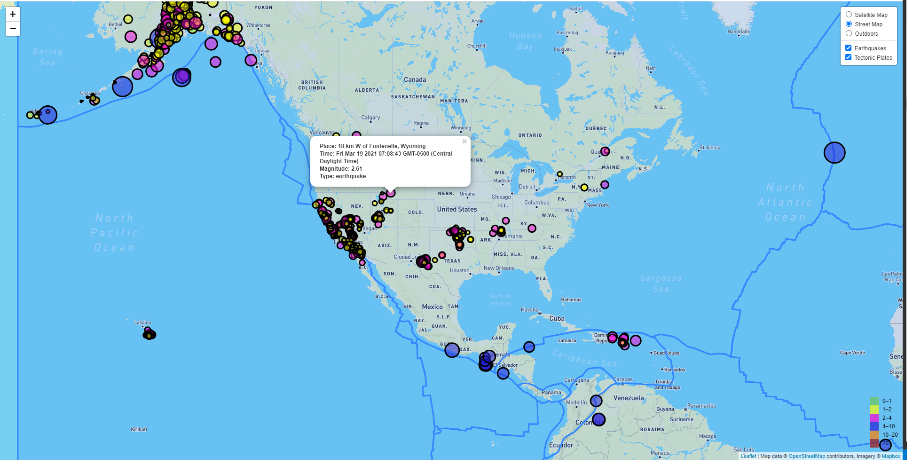
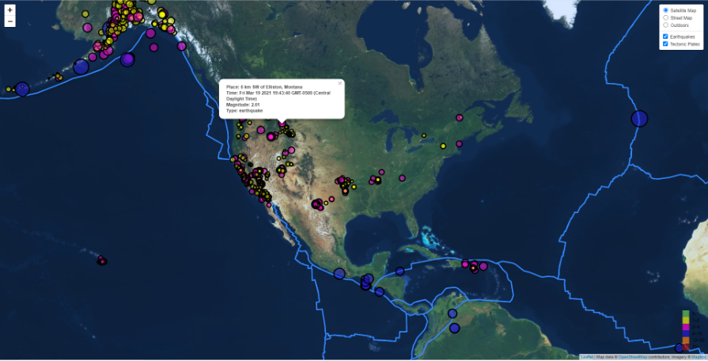
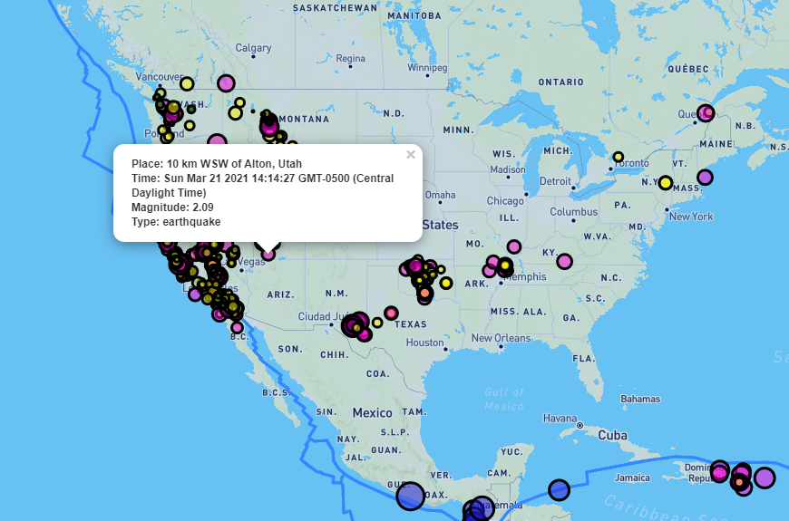
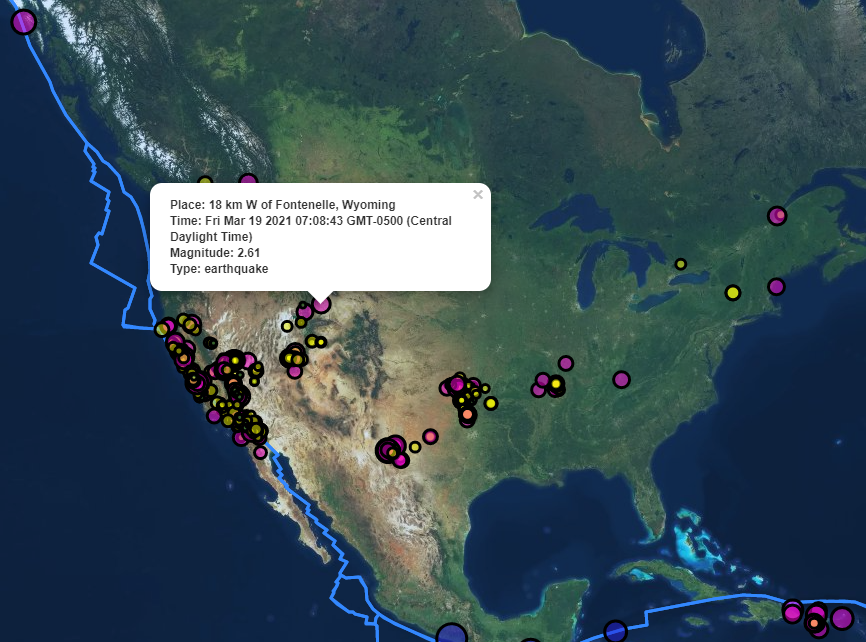

# Leaflet-Challenge - Visualizing Data with Leaflet

## Background

Welcome to the United States Geological Survey, or USGS for short! The USGS is responsible for providing scientific data about natural hazards, the health of our ecosystems and environment; and the impacts of climate and land-use change. Their scientists develop new methods and tools to supply timely, relevant, and useful information about the Earth and its processes. This new hire will be helping them out with an exciting new project!

The USGS is interested in building a new set of tools that will allow them visualize their earthquake data. They collect a massive amount of data from all over the world each day, but they lack a meaningful way of displaying it. Their hope is that being able to visualize their data will allow them to better educate the public and other government organizations (and hopefully secure more funding..) on issues facing our planet. Visualizing the data can help realize this objective.

### Here we go
These are the steps taken in this challenge:

### Level 1: Basic Visualization

### Our Basic Visualization

The finalized webpage/app has been deployed to github page. Click [here](https://jonathanezeugo.github.io/leaflet-challenge/index.html) to view the rendered page.

### Proceedure
The first task was to visualize an earthquake data set.

1. **Obtaining the data set**

   

   The USGS provides earthquake data in a number of different formats, updated every 5 minutes. The site to visit is [USGS GeoJSON Feed](http://earthquake.usgs.gov/earthquakes/feed/v1.0/geojson.php). The 'all-week' dataset was picked and visualized. When the 'All Earthquakes from the Past 7 Days' was clicked, a JSON representation of that data was downloaded. Also obtained the URL of this JSON to pull in the data for visualization.

   

2. **Importing & Visualizing of the Data**

   Created a map using Leaflet that plots all of the earthquakes from the data set based on their longitude and latitude.

   * Created data markers that reflected the magnitude of the earthquake by their size and depth of the earth quake by color. Earthquakes with higher magnitudes appear larger and earthquakes with greater depth appear darker in color. This variation helps improve visualization.

   * Included popups that provide additional information about the earthquake when a marker is clicked. Information displayed are earthquake place, time, magnitude and type.

   * Created a legend that provides context for the map data.

   * Here's the visualization in the map below.

   
   
- - -

### Level 2: More Data 

   

   

The USGS needed to plot a second data set on the map, to illustrate the relationship between tectonic plates and seismic activity. A second data set was pulled and visualized alongside the original set of data. Data on tectonic plates can be found at <https://github.com/fraxen/tectonicplates>.

This step involved..

* Plotting a second data set on the map.

* Addding a number of base maps - Satellite map, Street map and Outdoor map to choose from as well as separated out two different data sets (earthquake and tectonic plates) into overlays that can be turned on and off independently. Please note: the default page allows for clicking on each location to see the bound popup information.

* Added layer controls to the map to view different pages.

Key components used here are JavaScript, CSS, HTML, and VS code.

### Copyright

© 2021 Trilogy Education Services, LLC, a 2U, Inc. brand. Confidential and Proprietary. All Rights Reserved.
